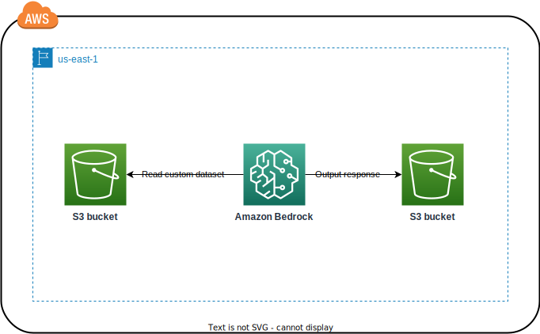

# Architecture Overview

## AWS

The goal here is to run a *convenient* workflow using the Amazon Bedrock foundational model, security guardrails feature and an S3 bucket storage.

### Architecture

#### Components

##### S3 bucket
* Stores the input (prompt dataset) in one directory.
* Stores the output (foundation LLM responses) in separate directories.

##### Amazon Bedrock Foundation LLM
* Llama

## GCP
### Coming Soon!

## Azure
### Coming Soon!

